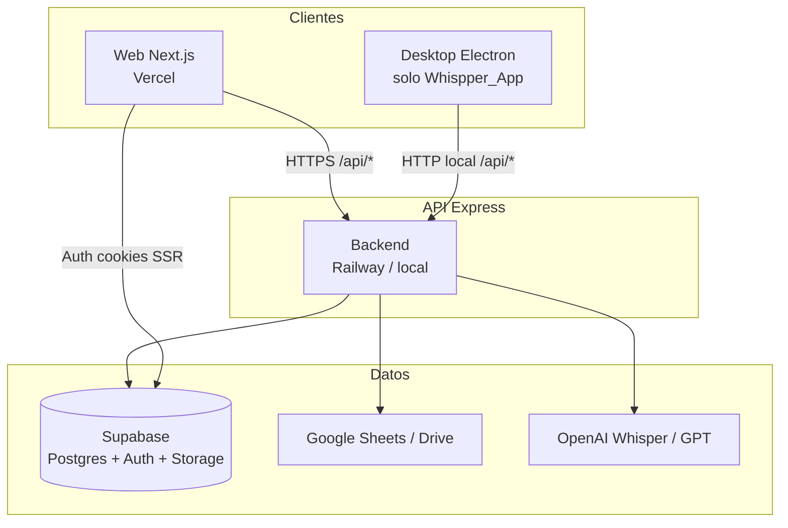
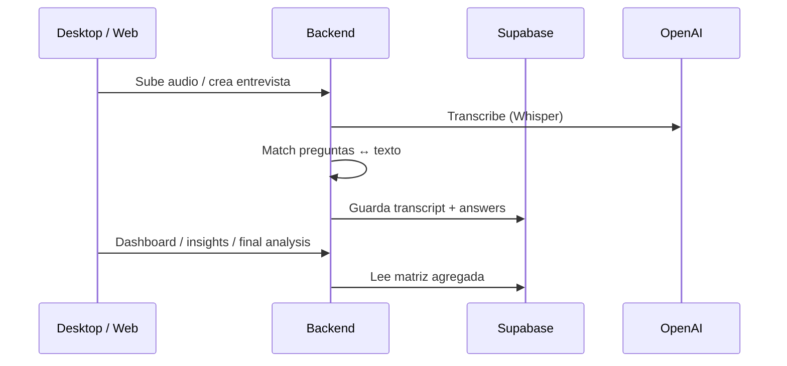
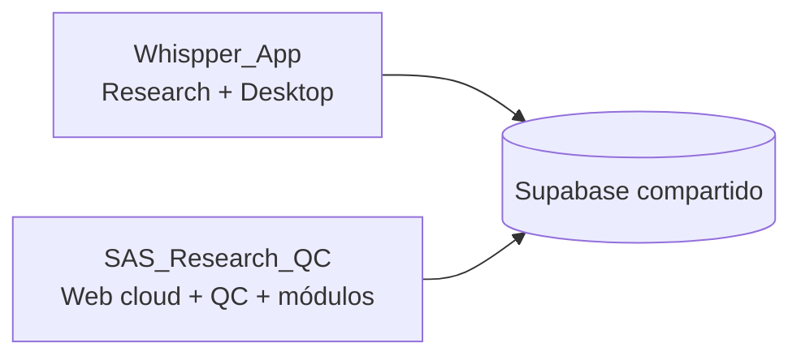

# Arquitectura — SAS RESEARCH / Whispper

Documento de arquitectura del ecosistema de productos: **Whispper_App** (Research + desktop) y **SAS_Research_QC** (plataforma web desplegable + Control de Calidad).

> Estado actual: `SAS_Research_QC` ya no es solo QC. Remonta la plataforma modular completa (Research, Proyectos, Informes, QC) para Vercel/Railway. Whispper_App sigue siendo el twin con **Electron** y captura local.

---

## 1. Vista general



| Pieza | Whispper_App | SAS_Research_QC |
|-------|--------------|-----------------|
| Rol | Research + captura local (desktop) | Plataforma web cloud + QC |
| Workspaces | `backend`, `web`, `desktop`, `shared` | `backend`, `web`, `shared` |
| Desktop Electron | Sí | No |
| Puerto API local típico | `4000` | `4001` |
| Deploy web | Opcional / local | **Vercel** |
| Deploy API | Local / propio | **Railway** (`powerbiresearch.online`) |
| Supabase | Mismo proyecto (recomendado) | Mismo; tablas `qc_*` aditivas |

---

## 2. Monorepo

### 2.1 Whispper_App

```
Whispper_App/
├── backend/          # Express API
├── web/              # Next.js 14 App Router
├── desktop/          # Electron + Vite (grabación)
├── shared/           # @whispper/shared tipos
├── database/         # SQL + seeds Research/QC
├── scripts/          # utilidades
└── package.json      # workspaces
```

### 2.2 SAS_Research_QC

```
SAS_Research_QC/
├── backend/          # Express API (full platform + QC)
├── web/              # Next.js 14 App Router
├── shared/           # @whispper/shared tipos
├── database/         # migraciones auth + QC
├── docs/             # DEPLOY, PASOS, esta arquitectura
├── scripts/
├── railway.json
└── package.json
```

**Paquete compartido:** `@whispper/shared` → `shared/types/index.ts`  
Tipos de Research, proyectos modulares, IA, propuestas, informes configurados, admin y dominio QC completo.

---

## 3. Backend (Express)

**Entrypoint:** `backend/src/index.ts`  
**Config:** `backend/src/config.ts`  
**Repos:** `backend/src/db/supabase-repositories.ts`  
**Cliente Supabase:** `backend/src/lib/supabaseClient.ts` (service role)

### 3.1 Rutas montadas

| Prefijo | Router | Dominio |
|---------|--------|---------|
| `GET /` | inline JSON | Info de servicio (SAS) |
| `/api/health` | `routes/health.ts` | Healthcheck |
| `/api/projects` | `routes/projects.ts` | Proyectos Research (entrevistas) |
| `/api/interviews` | `routes/interviews.ts` | Entrevistas / respuestas |
| `/api/dashboard` | `routes/dashboard.ts` | KPIs matriz Research |
| `/api/final-analysis` | `routes/finalAnalysis.ts` | Análisis final proveedor |
| `/api/module-projects` | `routes/moduleProjects.ts` | Proyectos de plataforma |
| `/api/module-proposals` | `routes/moduleProposals.ts` | Propuestas versionadas |
| `/api/configured-reports` | `routes/configuredReports.ts` | Informes / plantillas / runs |
| `/api/ai` | `routes/ai.ts` | Análisis de reuniones (IA) |
| `/api/admin` | `routes/admin.ts` | Overview / auditoría admin |
| `/api/qc` | `routes/qc.ts` | Control de Calidad (multi-tenant) |

> También existe `routes/categories.ts` (categorías de preguntas); en SAS puede no estar montado en el entrypoint.

### 3.2 Servicios clave

**Research / pipeline**
- `transcriptionService` — Whisper / transcripción
- `matchService` — matching preguntas ↔ respuestas
- `insightsService` — insights
- `pipelineService` — orquestación
- `dashboardService` — matriz / stats
- `finalAnalysisService` / `finalAnalysisBuild`
- `audioPreprocessor` — ffmpeg / audio
- `googleSheetsService` / `googleDriveService`

**QC**
- `qcRulesEngine` — evaluación y aplicación de reglas
- `qcEvidenceStorage` — evidencias en Supabase Storage (`qc-evidences`)
- `qcIntegrationSync` — sync Sheets/Zoho → `qc_surveys`
- `qcWebhooks` — eventos salientes
- `reportEngine` — motor de informes configurados (bloques + fecha → filas)

### 3.3 Repositorios (Supabase)

`projectRepo`, `managedProjectRepo`, `aiMeetingAnalysisRepo`, `moduleProposalRepo`, `configuredReportRepo`, `adminRepo`, `categoryRepo`, `questionRepo`, `interviewRepo`, `transcriptRepo`, `answerRepo`, `insightsRepo`, `qcRepo`

---

## 4. Web (Next.js 14 App Router)

**Layout raíz:** `web/src/app/layout.tsx`  
**Middleware auth:** `web/middleware.ts` → `web/src/lib/supabase/middleware.ts`  
**Registry de módulos:** `web/src/platform/registry/index.ts`  
**Shell:** `PlatformShell` + `PlatformSidebar` + `PlatformNavbar`  
**Home:** `page.tsx` → `ModuleLauncher`

### 4.1 Capas de plataforma

```
web/src/platform/
├── registry/          # moduleRegistry
├── launcher/          # tarjetas de módulos
├── components/        # Shell, Sidebar, Navbar, ThemeProvider, LayoutRouter
├── auth/              # Login, RequireAuth, UserMenu, perfiles
└── types/             # ModuleConfig
```

**UI kit (design system):** `web/src/components/ui/`  
Button, Card, Badge, Input, Alert, Dialog, AlertDialog, Tooltip, Sonner + `cn()` (`lib/utils.ts`).  
Tema **claro / oscuro** (`ThemeProvider` + tokens en `globals.css`).

**Data:** TanStack Query (`QueryProvider`), fetch vía `web/src/lib/api.ts`.

### 4.2 Módulos activos (launcher)

| Módulo | Ruta base | Descripción |
|--------|-----------|-------------|
| Research Intelligence | `/m/whispper-research` | Entrevistas, proveedores, propuestas, exploratorio, análisis, insights, cuestionario |
| Proyectos | `/m/projects` | Gestión de proyectos de plataforma |
| Informes Configurados | `/m/informes` | Plantillas (bloques) + Generar por fechas → Excel |
| Control de Calidad | `/m/qc` | Multi-tenant QC (encuestas, reglas, evidencias, etc.) |

**Presentes pero deshabilitados en launcher:** `/m/ia`, `/m/propuestas`.

### 4.3 Secciones Research (`/m/whispper-research`)

- `resumen`, `participants`, `providers`, `providers/[slug]`
- `proposals`, `exploratory`, `analysis`, `insights`, `cuestionario`

### 4.4 Secciones QC (`/m/qc`)

- `dashboard`, `encuestas`, `encuestas/[id]`
- `reglas`, `reportes`, `integraciones`, `webhooks`, `auditoria`
- `proyectos`, `clientes`, `organizacion`, `miembros`, `inicio`

El menú del módulo activo se muestra en el **sidebar lateral** (no barra horizontal).

### 4.5 Auth

Rutas públicas: `/login`, `/forgot-password`, `/reset-password`, `/auth/callback`.  
Todo lo demás exige sesión (middleware + `RequireAuth`).

Flujo:
1. Login email/password (Supabase Auth)
2. Cookies SSR (`@supabase/ssr`)
3. Callback OAuth/magic: `exchangeCodeForSession`
4. `ensureUserProfile` tras sign-in
5. Backend opera con **service role** (hoy QC aún recibe `userId` del cliente; pendiente QC-12 JWT)

---

## 5. Desktop (solo Whispper_App)

`desktop/` — Electron + Vite.

- Captura de audio de entrevistas
- Habla con el backend local (`/api/...`)
- CORS en Whispper permite origen `null` (file://) y Vite `:5173`

**No existe en SAS_Research_QC.** La nube no incluye grabación nativa; el flujo cloud asume datos vía API / sync.

---

## 6. Base de datos (Supabase)

### 6.1 Research / plataforma (histórico Whispper)

Tablas típicas: proyectos, categorías, preguntas, entrevistas, transcripciones, respuestas, insights, análisis final, módulos, `module_projects`, propuestas, informes configurados, AI meeting analysis, perfiles auth.

Migraciones / seeds viven sobre todo en **Whispper_App** (`database/supabase_migration_module_*`, `phases_7_11`, scripts de carga).

### 6.2 QC (aditivo, ambos repos)

| Migración | Contenido |
|-----------|-----------|
| `auth_profiles` | Perfiles + RLS básica |
| `qc_0_1` | Orgs, roles, permisos, memberships |
| `qc_2` | Proyectos QC + clientes |
| `qc_3` | Encuestas + etapas de revisión |
| `qc_4` | Motor de reglas |
| `qc_5` | Evidencias + audit log |
| `qc_6` | Integraciones Sheets/Zoho |
| `qc_8` | Sync upsert / `external_id` |
| `qc_9` | Auto-acciones + webhooks |
| `qc_10` | Storage evidencias |
| `qc_11` | Historial exports de reportes |

No hay `qc_7.sql` (dashboard = API/UI).

**Storage bucket:** `qc-evidences`.

---

## 7. Flujos de producto

### 7.1 Research Intelligence (Whispper clásico)



### 7.2 Informes Configurados

1. **Configurar plantilla:** Sheet ID + columna fecha + bloques (filtrar, cruzar, etc.)
2. **Generar:** usuario elige fechas → `POST /api/configured-reports/:id/run`
3. Motor (`reportEngine`) lee Sheet (o demo), aplica pasos/filtros, devuelve filas
4. Web descarga **Excel/CSV**

### 7.3 Control de Calidad

1. Org + miembros + roles  
2. Clientes / proyectos QC  
3. Encuestas (manual o sync integración)  
4. Etapas: ubicación → contenido → teléfono  
5. Reglas automáticas + evidencias + auditoría  
6. Reportes / webhooks  

---

## 8. Deploy

Detalle operativo: [`docs/DEPLOY.md`](./DEPLOY.md)

| Capa | Host | Notas |
|------|------|-------|
| Web | Vercel | Root Directory = `web`; build monorepo `cd .. && npm run build -w web` |
| API | Railway | `railway.json` → build shared+backend; dominio ej. `powerbiresearch.online` |
| Auth | Supabase | Site URL + redirects del dominio Vercel |

Variables clave (nombres):

**Backend:** `PORT`, `SUPABASE_URL`, `SUPABASE_ANON_KEY`, `SUPABASE_SERVICE_ROLE_KEY`, `OPENAI_*`, `GOOGLE_SHEETS_*`, `GOOGLE_DRIVE_*`, `ALLOWED_ORIGINS`, paths de grabaciones/transcripciones  

**Web:** `NEXT_PUBLIC_API_URL`, `NEXT_PUBLIC_SUPABASE_URL`, `NEXT_PUBLIC_SUPABASE_ANON_KEY`

---

## 9. Relación entre repos



| Qué | Dónde vive |
|-----|------------|
| Captura audio Electron | Solo Whispper_App |
| Pipeline entrevistas / dashboard Research | Ambos backends (código hermanado) |
| Plataforma modular web | Ambos; **deploy oficial en SAS** |
| QC multi-tenant | Nació en Whispper; producto/deploy en SAS |
| Migraciones `qc_*` | Idempotentes / aditivas en el mismo proyecto Supabase |

**Regla de producto:** no dañar el flujo Research/desktop de Whispper; QC y plataforma cloud evolucionan en SAS sin pisar tablas core de entrevistas.

---

## 10. Stack técnico

| Capa | Tecnología |
|------|------------|
| Web | React 18, Next.js 14, TypeScript, Tailwind 3, Lucide, Framer Motion, TanStack Query, Radix/shadcn-style UI |
| Auth | Supabase Auth + `@supabase/ssr` |
| API | Node, Express, TypeScript |
| Datos | Supabase (Postgres, Storage, Auth) |
| IA | OpenAI Whisper + GPT |
| Integraciones | Google Sheets / Drive, webhooks QC |
| Desktop | Electron + Vite (Whispper) |
| Deploy | Vercel + Railway |

---

## 11. Roadmap / deuda conocida

Ver [`PASOS_A_SEGUIR.md`](./PASOS_A_SEGUIR.md). Destacados:

- **QC-12:** validar JWT en `/api/qc` (dejar de confiar solo en `userId` del body)
- Sync incremental integraciones
- Notificaciones
- README raíz de SAS aún describe a veces “solo QC”; la arquitectura real es la de este documento

---

## 12. Entrypoints rápidos (SAS_Research_QC)

| Pieza | Ruta |
|-------|------|
| Workspace root | `package.json` |
| API | `backend/src/index.ts` |
| Config API | `backend/src/config.ts` |
| Web layout | `web/src/app/layout.tsx` |
| Middleware | `web/middleware.ts` |
| Registry módulos | `web/src/platform/registry/index.ts` |
| Tipos | `shared/types/index.ts` |
| Deploy | `docs/DEPLOY.md` |
| Continuidad QC | `docs/PASOS_A_SEGUIR.md` |

---

*Última actualización: documento generado para reflejar plataforma completa (Whispper + QC) y el deploy en SAS_Research_QC.*
